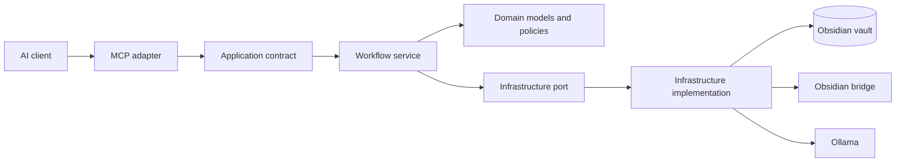
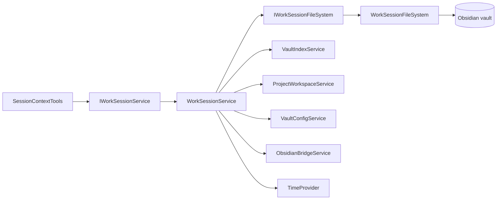
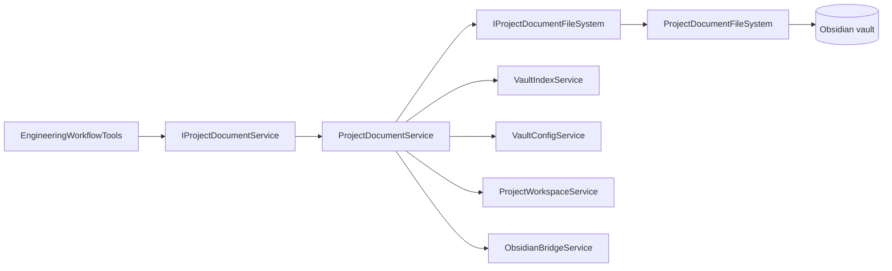
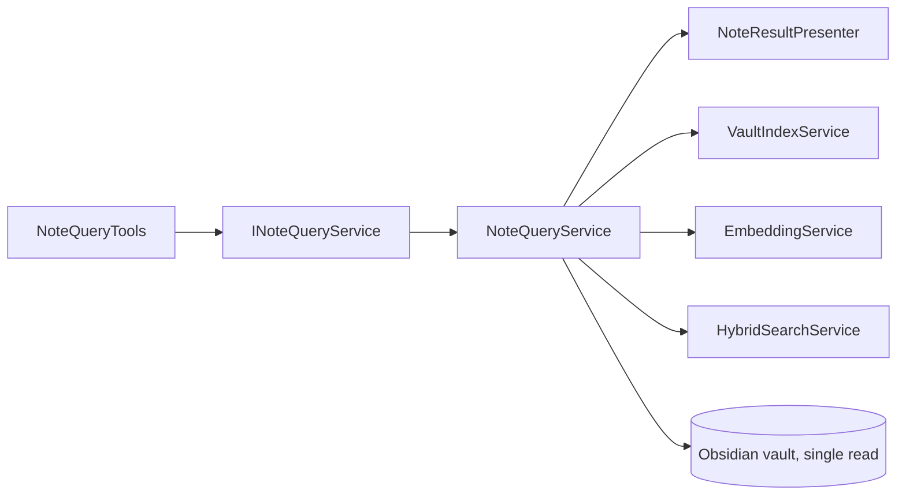

# Kioku architecture

Kioku separates MCP tool adapters from application and infrastructure workflow logic, delivered incrementally by vertical slice (issue #250). The goal is to keep the public MCP surface stable while moving workflow orchestration behind application contracts and keeping transport concerns in the MCP adapter layer.

## Dependency direction

Dependencies point inward from protocol adapters toward application contracts. Workflow services must not require an MCP server instance or call host filesystem APIs directly. Infrastructure details remain behind ports owned and registered by the host container.

This direction is enforced by architecture tests inside the single `Kioku.Mcp.Server` project rather than by separate `Kioku.Application`/`Kioku.Infrastructure` assemblies — see the "Project boundaries" entry in the migration plan below for why.

## Responsibility table

| Area | Responsibility | Current examples |
| --- | --- | --- |
| MCP adapters | MCP attributes, descriptions, protocol-only arguments, client metadata, cancellation capture, delegation | `SessionContextTools`, `EngineeringWorkflowTools`, `NoteQueryTools` |
| Application contracts | Stable workflow operations exposed to adapters | `IWorkSessionService`, `IProjectDocumentService`, `INoteQueryService` |
| Workflow services | Session/project/note orchestration and domain errors | `WorkSessionService`, `ProjectDocumentService`, `NoteQueryService`, `ProjectWorkspaceService` |
| Domain | Note metadata, frontmatter values, invariants and error models | `Note`, `NoteFrontmatter`, `KiokuError` |
| Result presentation | Renders a workflow outcome as the exact text/JSON string an MCP tool returns; holds no query or workflow decisions | `NoteResultPresenter` |
| Infrastructure ports | Contracts for external effects required by workflows | `IWorkSessionFileSystem`, `IProjectDocumentFileSystem` |
| Infrastructure implementations | Filesystem, indexing, bridge, embeddings, generation and persistence | `WorkSessionFileSystem`, `ProjectDocumentFileSystem`, `VaultIndexService`, `ObsidianBridgeService`, `EmbeddingService` |
| Hosting | Configuration, dependency injection, lifecycle, transports and readiness | `KiokuHostingExtensions`, `KiokuLifecycleService`, `Program.cs` |

## Session vertical slice

The production session adapter exposes exactly one constructor and depends only on `IWorkSessionService`. It no longer constructs `WorkSessionService` or receives vault, configuration, bridge, workspace, clock, or filesystem infrastructure dependencies through any activation path.

`IWorkSessionService` and `WorkSessionService` are registered as a singleton mapping in `AddKiokuRuntime`. `IWorkSessionFileSystem` is registered separately through `AddWorkSessionInfrastructure`, keeping infrastructure composition out of the workflow service.

The MCP SDK injects a `CancellationToken` into each session tool call. The adapter forwards it through the application boundary to session locks, template waits, file reads, collision-safe file creation, atomic replacement, reindex waits, and Obsidian bridge waits. The token is an injected runtime dependency and is not part of the public MCP input schema.

`WorkSessionService` and its helper partial contain no direct `File.*` or `Directory.*` calls. Those operations are implemented by `WorkSessionFileSystem`, which preserves the existing collision-safe create-new behavior and temporary-file atomic replacement.

Session integration tests now compose `WorkSessionService` through the test-only `WorkSessionTestHarness` and execute `IWorkSessionService` directly. MCP adapter shape and metadata remain covered by dedicated architecture and contract tests. The former `SessionContextTools.Compatibility.cs` production shim has been removed.

Architecture tests enforce that:

- `SessionContextTools` has exactly one instance constructor, it is public, and its only dependency is `IWorkSessionService`;
- every public session tool receives an injected `CancellationToken` as its final runtime parameter;
- the host maps `IWorkSessionService` to `WorkSessionService` and `IWorkSessionFileSystem` to `WorkSessionFileSystem` as singletons;
- the production adapter does not construct or reference session infrastructure;
- the session workflow contains no direct `File.*` or `Directory.*` calls.

## Project-document vertical slice

The production project-document adapter, `EngineeringWorkflowTools`, exposes exactly one constructor and depends only on `IProjectDocumentService`. It no longer constructs `ProjectDocumentService` or receives vault, configuration, bridge, workspace, or filesystem infrastructure dependencies through any activation path.

`IProjectDocumentService` and `ProjectDocumentService` are registered as a singleton mapping in `AddKiokuRuntime`. `IProjectDocumentFileSystem` is registered separately through `AddProjectDocumentInfrastructure`, keeping infrastructure composition out of the workflow service.

The MCP SDK injects a `CancellationToken` into each project-document tool call. The adapter forwards it through the application boundary to every ADR, bug, plan, knowledge, backlog-item, project-context, and engineering-template operation.

`ProjectDocumentService` contains no direct `File.*` or `Directory.*` calls. Those operations are implemented by `ProjectDocumentFileSystem`, which owns directory creation, collision checks, timestamp reads, recursive markdown enumeration, and read/write/append operations.

Project-document integration tests compose `ProjectDocumentService` through the test-only `ProjectDocumentTestHarness` and execute `IProjectDocumentService` directly. MCP adapter shape and metadata remain covered by dedicated architecture and contract tests.

Architecture tests enforce that:

- `EngineeringWorkflowTools` has exactly one instance constructor, it is public, and its only dependency is `IProjectDocumentService`;
- every public project-document tool receives an injected `CancellationToken` as its final runtime parameter;
- the host maps `IProjectDocumentService` to `ProjectDocumentService` and `IProjectDocumentFileSystem` to `ProjectDocumentFileSystem` as singletons;
- the production adapter does not construct or reference project-document infrastructure;
- `ProjectDocumentTestHarness` does not depend on the MCP adapter or SDK;
- the project-document workflow contains no direct `File.*` or `Directory.*` calls.

## Note-query vertical slice

The production note-query adapter, `NoteQueryTools`, exposes exactly one constructor and depends only on `INoteQueryService`. Unlike the session and project-document slices, this slice has no filesystem infrastructure port: `NoteQueryTools` is read-only, and its one direct file read (re-reading a note's current content in `read_note`) stays inside `NoteQueryService` rather than behind a dedicated port — introducing a port for a single `File.ReadAllTextAsync` call was judged not worth the indirection. The split that matters for this slice is query logic versus text/JSON presentation.

`INoteQueryService` and `NoteQueryService` are registered as a singleton mapping in `AddKiokuRuntime`. `NoteQueryService` decides what happened (found or not found, valid or invalid, empty or populated) and delegates every text or JSON rendering decision to `NoteResultPresenter`; it does not build response strings itself.

The MCP SDK injects a `CancellationToken` into `read_note` and `search_notes`; the adapter forwards it through the application boundary. `list_notes`, `get_links`, and `find_similar_notes` are synchronous and do not need one.

Note-query tests compose `NoteQueryTools` directly with a `NoteQueryService` built from test doubles — no MCP server bootstrap is required to exercise the workflow.

Architecture tests enforce that:

- `NoteQueryTools` has exactly one instance constructor, it is public, and its only dependency is `INoteQueryService`;
- every public async note-query tool receives an injected `CancellationToken` as its final runtime parameter;
- the host maps `INoteQueryService` to `NoteQueryService` as a singleton;
- the production adapter does not construct `NoteQueryService`, depend on its collaborator services, or contain presentation/file-access logic;
- `NoteQueryService` does not build JSON or text responses itself.

## Incremental migration plan

Issue #250 is intentionally delivered in vertical slices:

1. **Session application boundary** — adapter delegation, DI ownership, architecture guard tests. Completed by #283.
2. **Session infrastructure ports** — move direct session filesystem operations behind `IWorkSessionFileSystem` and propagate cancellation to those I/O boundaries. Completed by #284.
3. **Session fixture cleanup** — replace internal compatibility constructors with a test-only application-service harness and delete the production shim. Completed by #287.
4. **Project-document workflows** — extract engineering orchestration from MCP adapters behind `IProjectDocumentService`/`ProjectDocumentService`, with filesystem effects behind `IProjectDocumentFileSystem`/`ProjectDocumentFileSystem`. Completed by #290.
5. **Note queries and presenters** — separate query use cases from protocol and textual presentation behind `INoteQueryService`/`NoteQueryService` and `NoteResultPresenter`. Completed by #291.
6. **Project boundaries** — decide whether to extract `Kioku.Application`/`Kioku.Infrastructure` as separate projects now that slices 4–5 have shipped.

   **Decision: keep the single `Kioku.Mcp.Server` project, enforced by architecture-guard tests.** No new assemblies were introduced. Issue #250 explicitly allows this outcome: "A smaller first step with fewer projects is acceptable if dependency direction is enforced." At the time of this decision, the contracts extracted in slices 4 and 5 (`IProjectDocumentService`, `INoteQueryService`, and their implementations) were hours old with no usage beyond their own test suites — there was no evidence of the kind of interface stability or cross-cutting reuse pressure that would justify assembly boundaries, and splitting now would add packaging and build complexity without a corresponding payoff. The architecture-test approach has a three-slice track record (`WorkSessionArchitectureTests`, `ProjectDocumentArchitectureTests`, `NoteQueryArchitectureTests`) of catching dependency-direction and adapter-shape regressions without that overhead. If a future slice needs independent packaging, versioning, or reuse outside `Kioku.Mcp.Server`, revisit this decision then rather than pre-emptively.

All six slices are complete; issue #250 is closed. The diagrams and tables above describe the current implementation, not an aspirational target. Public tool names, schemas, annotations and result contracts remain protected by the existing metadata and MCP contract checks.
