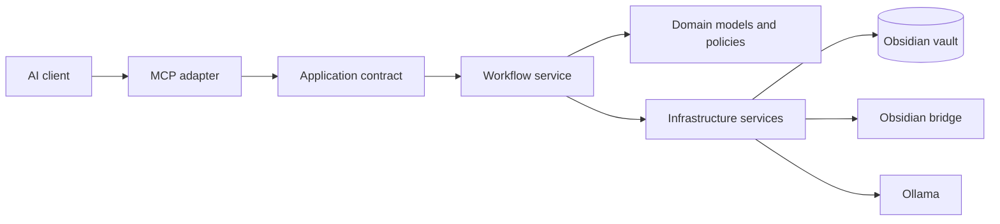
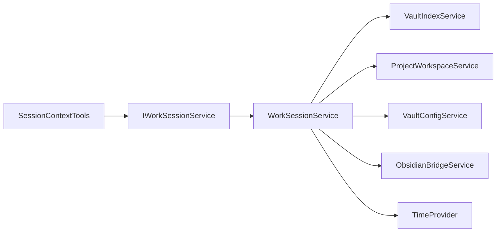

# Kioku architecture

Kioku is being separated incrementally by vertical slice. The goal is to keep the public MCP surface stable while moving workflow orchestration behind application contracts and keeping transport concerns in the MCP adapter layer.

## Dependency direction

Dependencies point inward from protocol adapters toward application contracts. Workflow services must not require an MCP server instance. Infrastructure details remain behind services owned and registered by the host container.

## Responsibility table

| Area | Responsibility | Current examples |
| --- | --- | --- |
| MCP adapters | MCP attributes, descriptions, protocol-only arguments, client metadata, delegation | `SessionContextTools`, `NoteQueryTools` |
| Application contracts | Stable workflow operations exposed to adapters | `IWorkSessionService` |
| Workflow services | Session/project/note orchestration and domain errors | `WorkSessionService`, `ProjectWorkspaceService` |
| Domain | Note metadata, frontmatter values, invariants and error models | `Note`, `NoteFrontmatter`, `KiokuError` |
| Infrastructure | Filesystem, indexing, bridge, embeddings, generation and persistence | `VaultIndexService`, `ObsidianBridgeService`, `EmbeddingService` |
| Hosting | Configuration, dependency injection, lifecycle, transports and readiness | `KiokuHostingExtensions`, `KiokuLifecycleService`, `Program.cs` |

## Session vertical slice

The production session adapter exposes one public constructor and depends only on `IWorkSessionService`. It no longer constructs `WorkSessionService` or receives vault, configuration, bridge, workspace, or clock infrastructure dependencies through its production activation path.

`IWorkSessionService` and `WorkSessionService` are registered as a singleton mapping in `AddKiokuRuntime`. Session workflow tests can instantiate and execute the application service without starting an MCP host.

Existing integration fixtures still use internal compatibility constructors isolated in `SessionContextTools.Compatibility.cs`. They are not used by MCP activation and should be removed when those fixtures are migrated to shared service builders in the next architecture slice.

Architecture tests enforce that:

- `SessionContextTools` exposes one public constructor whose only dependency is `IWorkSessionService`;
- the host maps `IWorkSessionService` to `WorkSessionService` as a singleton;
- the production adapter source does not construct the workflow service or reference session infrastructure dependencies.

## Incremental migration plan

Issue #250 is intentionally delivered in vertical slices:

1. **Session application boundary** — adapter delegation, DI ownership, architecture guard tests.
2. **Session infrastructure ports** — move direct filesystem operations behind a vault/session repository abstraction, migrate the remaining compatibility fixtures, and propagate cancellation to I/O.
3. **Project-document workflows** — extract engineering orchestration from MCP adapters.
4. **Note queries and presenters** — separate query use cases from protocol and textual presentation.
5. **Project boundaries** — introduce separate application/infrastructure projects only when the extracted contracts are stable enough to justify the additional assemblies.

Until those slices are complete, this document distinguishes the target direction from the current implementation. Public tool names, schemas, annotations and result contracts remain protected by the existing metadata and MCP contract checks.
