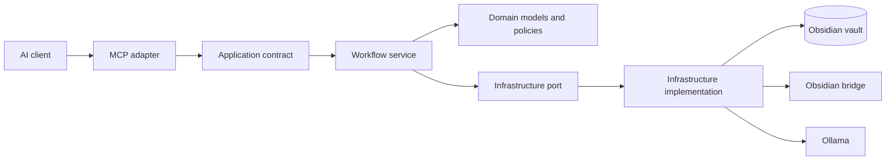
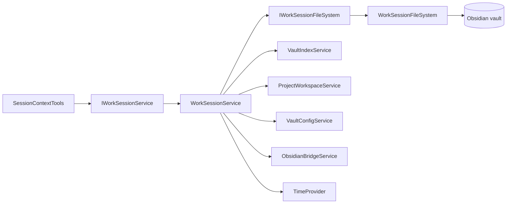

# Kioku architecture

Kioku is being separated incrementally by vertical slice. The goal is to keep the public MCP surface stable while moving workflow orchestration behind application contracts and keeping transport concerns in the MCP adapter layer.

## Dependency direction

Dependencies point inward from protocol adapters toward application contracts. Workflow services must not require an MCP server instance or call host filesystem APIs directly. Infrastructure details remain behind ports owned and registered by the host container.

## Responsibility table

| Area | Responsibility | Current examples |
| --- | --- | --- |
| MCP adapters | MCP attributes, descriptions, protocol-only arguments, client metadata, cancellation capture, delegation | `SessionContextTools`, `NoteQueryTools` |
| Application contracts | Stable workflow operations exposed to adapters | `IWorkSessionService` |
| Workflow services | Session/project/note orchestration and domain errors | `WorkSessionService`, `ProjectWorkspaceService` |
| Domain | Note metadata, frontmatter values, invariants and error models | `Note`, `NoteFrontmatter`, `KiokuError` |
| Infrastructure ports | Contracts for external effects required by workflows | `IWorkSessionFileSystem` |
| Infrastructure implementations | Filesystem, indexing, bridge, embeddings, generation and persistence | `WorkSessionFileSystem`, `VaultIndexService`, `ObsidianBridgeService`, `EmbeddingService` |
| Hosting | Configuration, dependency injection, lifecycle, transports and readiness | `KiokuHostingExtensions`, `KiokuLifecycleService`, `Program.cs` |

## Session vertical slice

The production session adapter exposes one public constructor and depends only on `IWorkSessionService`. It no longer constructs `WorkSessionService` or receives vault, configuration, bridge, workspace, clock, or filesystem infrastructure dependencies through its production activation path.

`IWorkSessionService` and `WorkSessionService` are registered as a singleton mapping in `AddKiokuRuntime`. `IWorkSessionFileSystem` is registered separately through `AddWorkSessionInfrastructure`, keeping infrastructure composition out of the workflow service.

The MCP SDK injects a `CancellationToken` into each session tool call. The adapter forwards it through the application boundary to session locks, template waits, file reads, collision-safe file creation, atomic replacement, reindex waits, and Obsidian bridge waits. The token is an injected runtime dependency and is not part of the public MCP input schema.

`WorkSessionService` and its helper partial contain no direct `File.*` or `Directory.*` calls. Those operations are implemented by `WorkSessionFileSystem`, which preserves the existing collision-safe create-new behavior and temporary-file atomic replacement.

Existing integration fixtures still use internal compatibility constructors isolated in `SessionContextTools.Compatibility.cs`. They are not used by MCP activation. Migrating those fixtures to a shared service builder and deleting the shim remains a small follow-up before the session slice is considered completely clean.

Architecture tests enforce that:

- `SessionContextTools` exposes one public constructor whose only dependency is `IWorkSessionService`;
- every public session tool receives an injected `CancellationToken` as its final runtime parameter;
- the host maps `IWorkSessionService` to `WorkSessionService` and `IWorkSessionFileSystem` to `WorkSessionFileSystem` as singletons;
- the production adapter does not construct or reference session infrastructure;
- the session workflow contains no direct `File.*` or `Directory.*` calls.

## Incremental migration plan

Issue #250 is intentionally delivered in vertical slices:

1. **Session application boundary** — adapter delegation, DI ownership, architecture guard tests. Completed by #283.
2. **Session infrastructure ports** — move direct session filesystem operations behind `IWorkSessionFileSystem` and propagate cancellation to those I/O boundaries. Implemented by the current follow-up; compatibility-fixture migration remains.
3. **Session fixture cleanup** — replace internal compatibility constructors with shared service builders and delete the shim.
4. **Project-document workflows** — extract engineering orchestration from MCP adapters.
5. **Note queries and presenters** — separate query use cases from protocol and textual presentation.
6. **Project boundaries** — introduce separate application/infrastructure projects only when the extracted contracts are stable enough to justify the additional assemblies.

Until those slices are complete, this document distinguishes the target direction from the current implementation. Public tool names, schemas, annotations and result contracts remain protected by the existing metadata and MCP contract checks.
