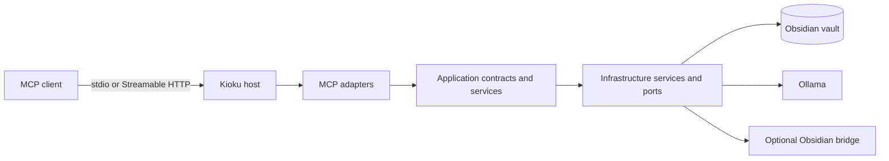

# Kioku architecture

This document describes the current internal structure of the `develop` branch. It records operational component boundaries, not the historical alternatives or reasoning that produced them.

## System boundary

The optional bridge is consumed by the independently versioned [`sandovaldavid/kioku-obsidian`](https://github.com/sandovaldavid/kioku-obsidian) plugin. The plugin source and release workflow are not part of this repository.

## Dependency direction

Dependencies point inward from protocol adapters to application contracts. Workflow services own domain decisions. Filesystem, indexing, bridge, embeddings, and process-hosting effects remain in infrastructure or hosting components.

The repository currently keeps these boundaries inside the single `Kioku.Mcp.Server` assembly and enforces them with architecture tests.

| Area | Responsibility | Current examples |
|---|---|---|
| MCP adapters | MCP attributes, descriptions, protocol arguments, client metadata, cancellation capture, delegation | `SessionContextTools`, `EngineeringWorkflowTools`, `NoteQueryTools`, `FocusedCreationTools` |
| Application contracts | Stable operations exposed to adapters | `IWorkSessionService`, `IProjectDocumentService`, `INoteQueryService` |
| Workflow services | Session, project-document, and note-query orchestration | `WorkSessionService`, `ProjectDocumentService`, `NoteQueryService`, `ProjectWorkspaceService` |
| Domain | Note metadata, frontmatter values, invariants, and error models | `Note`, `NoteFrontmatter`, `KiokuError` |
| Presentation | Render application results as MCP text and structured content | `NoteResultPresenter` |
| Infrastructure ports | Contracts for external effects | `IWorkSessionFileSystem`, `IProjectDocumentFileSystem`, `ICoordinationFileSystem` |
| Infrastructure services | Filesystem, indexing, bridge, embeddings, generation, and derived persistence | `WorkSessionFileSystem`, `ProjectDocumentFileSystem`, `CoordinationFileSystem`, `CoordinationEventStore`, `VaultIndexService`, `ObsidianBridgeService`, `EmbeddingService` |
| Hosting | Configuration, dependency injection, lifecycle, transports, and readiness | `KiokuHostingExtensions`, `KiokuLifecycleService`, `Program.cs` |

## Storage and indexing

Markdown files and YAML frontmatter in the configured Obsidian vault are the durable source of truth.

`VaultIndexService` builds derived in-memory indexes for words, tags, links, document lengths, and graph operations. A bounded indexing pipeline processes startup and file-change work. Tools explicitly synchronize mutations with the index, while a file watcher covers external changes.

Embeddings are derived data cached at `{vault}/.kioku/embeddings.bin`. The cache can be rebuilt and is not a database or system of record.

See [indexing-pipeline.md](indexing-pipeline.md), [vault-config.md](vault-config.md), and [threat-and-privacy-model.md](threat-and-privacy-model.md).

The coordination slice persists immutable event files and rebuildable work-item
projections under `.kioku/coordination/`. `CoordinationEventStore` validates
schema versions, hashes, sequence numbers, idempotency, and state transitions
before atomically writing an event. It uses per-work-item filesystem locks and
the pure `CoordinationProjectionReducer` to recover projections after restart.
Claims, note compare-and-swap mutation, and coordination MCP tools remain future
slices. The architecture and supported-filesystem boundary are documented in
[durable-coordination.md](durable-coordination.md).

## Retrieval

- Keyword retrieval uses indexed full-text scoring.
- Semantic retrieval uses Ollama embeddings when available.
- Hybrid retrieval combines keyword and semantic ranked results.
- Keyword search remains available when Ollama is unavailable.
- Optional generation requires `KIOKU_GEN_MODEL`.

Exact public tool schemas and modes are defined in [commands-reference.md](commands-reference.md). Reproducible measurements and evaluation methodology live in [benchmarks.md](benchmarks.md) and [retrieval-eval.md](retrieval-eval.md).

## Application slices

### Work sessions

`SessionContextTools` depends on `IWorkSessionService`. `WorkSessionService` owns session lifecycle and delegates filesystem operations to `IWorkSessionFileSystem` / `WorkSessionFileSystem`.

Architecture and integration tests enforce adapter shape, dependency injection, cancellation propagation, session ownership, collision-safe creation, and the absence of direct filesystem calls in the workflow service.

See [work-sessions.md](work-sessions.md).

### Project documents

`EngineeringWorkflowTools` and focused engineering creation tools delegate to `IProjectDocumentService`. `ProjectDocumentService` owns ADR, bug, plan, knowledge, backlog, project-context, and engineering-template workflows. Filesystem operations are delegated to `IProjectDocumentFileSystem` / `ProjectDocumentFileSystem`.

The generic `create_project_doc` surface remains a **Deprecated** compatibility wrapper. New integrations should use the focused tools listed in [focused-tool-migration.md](focused-tool-migration.md).

### Note queries

`NoteQueryTools` depends on `INoteQueryService`. `NoteQueryService` owns query outcomes and delegates response rendering to `NoteResultPresenter`.

The service reads current note content when required and otherwise works from the vault index, embeddings, and hybrid-search services. Architecture tests prevent the adapter from owning workflow or presentation logic.

## Capability profiles

Core query, command, and utility tools are always registered. The default profile enables `tasks`, `organization`, `sessions`, `workflows`, `graph`, and `engineering`. The optional groups `research`, `generation`, `css`, `assets`, `bridge`, and `plugin` are disabled by default.

Vault-level capability configuration controls registration at startup. Exact profile counts and schemas are generated in [commands-reference.md](commands-reference.md); configuration semantics are documented in [vault-config.md](vault-config.md).

## Transports and hosting

`stdio` is the default transport for a client-spawned local process. Streamable HTTP is selected with `KIOKU_TRANSPORT=http` and adds listener validation, origin checks, bearer authentication, request limits, readiness, and trusted-proxy handling.

The host validates configuration before starting runtime services. HTTP deployment guidance lives in [deploy/auth-options.md](deploy/auth-options.md).

## Contract enforcement

The test suite covers:

- MCP tool names, schemas, annotations, prompts, and resources;
- typed result and protocol-error behavior;
- application/infrastructure dependency boundaries;
- filesystem sandbox and permanent-delete policy;
- concurrent work-session ownership;
- frontmatter preservation;
- indexing synchronization and recovery;
- bridge protocol fixtures;
- HTTP authentication, origins, limits, and readiness.

Generated contracts are verified by `node scripts/generate-public-docs.mjs --check`. See [ci-quality-gates.md](ci-quality-gates.md) for the complete versioned gate.
